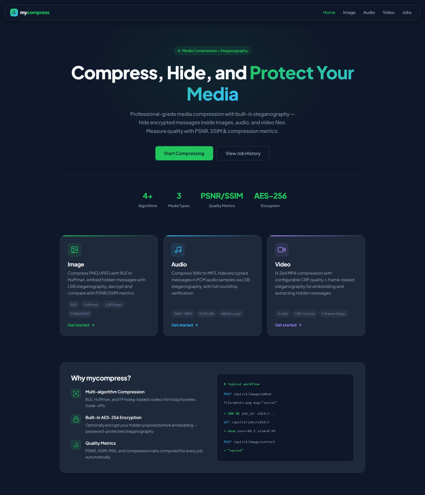
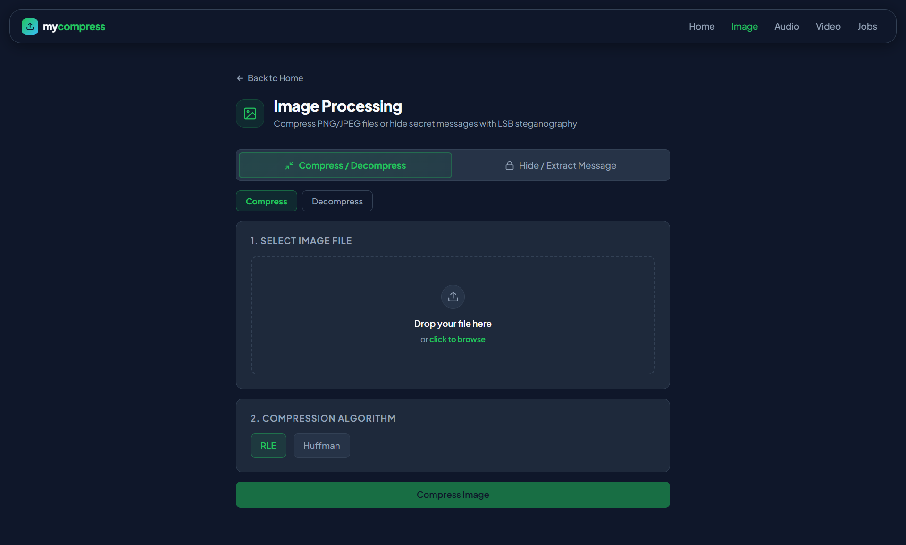
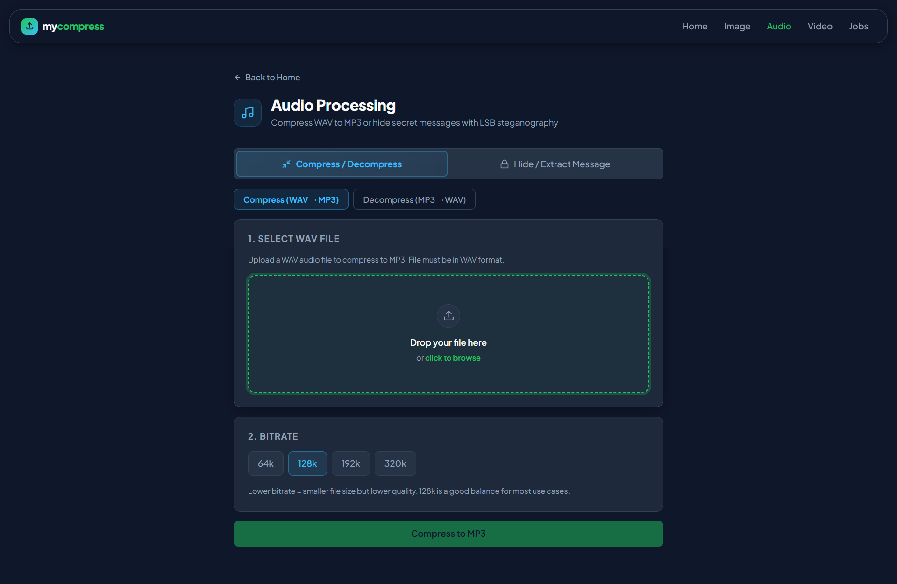
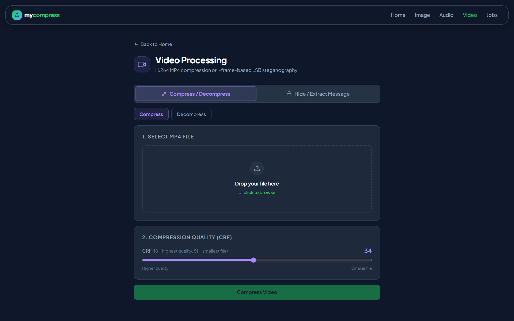
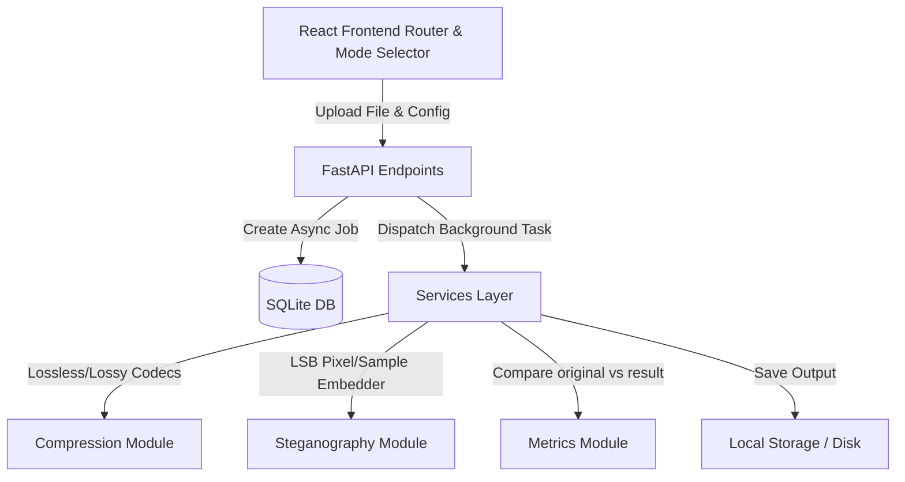

# MyCompress — Mesin Kompresi Media & Steganografi LSB

🇬🇧 [Read in English](./README.md)

[](https://www.python.org/)
[](https://fastapi.tiangolo.com/)
[](https://react.dev/)

MyCompress adalah aplikasi web terintegrasi yang dikembangkan untuk mengompresi file multimedia (Citra, Audio, dan Video) serta menyembunyikan pesan rahasia terenkripsi menggunakan metode steganografi *Least Significant Bit* (LSB). Proyek ini dirancang untuk memenuhi standar proyek akademik Pemrograman Perangkat Lunak (PPL).

Aplikasi ini berhasil memecahkan dilema mendasar dalam pemrosesan media: penerapan kompresi *lossy* pada berkas steganografi secara inheren akan merusak pesan rahasia di dalamnya karena perubahan bitwise. Dengan **memisahkan sepenuhnya (decoupling)** kedua jalur operasi di sisi UI dan backend menjadi **Compress-Only** dan **Stego-Only**, MyCompress menjamin keutuhan data pesan (*payload integrity*) sekaligus menyediakan opsi kompresi berkas yang andal.

---

## 🚀 Fitur Utama

1.  **Kompresi Multimedia Independen**:
    *   **Citra**: Kompresi lossless menggunakan algoritma RLE (Run-Length Encoding) dan Huffman Coding pada pixel warna RGB.
    *   **Audio**: Downscaling bitrate file WAV mentah ke format MP3 (lossy) via FFmpeg untuk memperkecil ukuran secara signifikan.
    *   **Video**: Kompresi lossy berbasis kualitas konstan (CRF 28) dengan encoder H.264 (`libx264`) via FFmpeg.
2.  **Steganografi LSB Tanpa Chaining**:
    *   **Citra**: Penyisipan pesan langsung ke LSB spasial kanal warna RGB citra PNG/JPG.
    *   **Audio**: Steganografi LSB pada sample data PCM 16-bit WAV asli (lossless) tanpa konversi MP3.
    *   **Video**: Steganografi I-frame LSB spasial yang diremux secara **lossless** menggunakan codec `libx264rgb` (CRF 0) untuk menjamin pesan tidak rusak.
3.  **Keamanan Pesan Tambahan**:
    *   Enkripsi AES-256 GCM opsional dengan perlindungan password sebelum pesan disisipkan.
    *   Opsi kompresi teks rahasia (RLE/Huffman) sebelum disisipkan untuk memaksimalkan kapasitas ruang media penampung.
4.  **Metrik Kualitas & Performa Riil**:
    *   Perhitungan matematis untuk metrik fidelitas: Peak Signal-to-Noise Ratio (PSNR), Structural Similarity Index (SSIM), dan Mean Squared Error (MSE).
    *   Visualisasi perbandingan ukuran file sebelum/sesudah beserta persentase efisiensi space.
5.  **Riwayat Pekerjaan (Job History)**:
    *   Log daftar pemrosesan lengkap dengan jenis operasi (`compress`, `decompress`, `embed`, `extract`) untuk memudahkan tracking.

---

## 📸 Antarmuka Pengguna

<!-- TODO: Capture screenshot antarmuka UI terbaru yang menampilkan Mode Selector tab (Compress vs Stego) serta panel detil teknis collapsible. Simpan di /docs/assets/ui_screenshot.png -->


### 🖼️ Image Processor Page
<!-- TODO: Dokumentasikan alur pemrosesan gambar di bawah ini -->


**Fitur Utama:** Kompresi gambar (JPEG, PNG, WebP) dan penyisipan pesan rahasia (Steganografi LSB).

### 🎵 Audio Processor Page
<!-- TODO: Dokumentasikan alur pemrosesan audio di bawah ini -->


**Fitur Utama:** Reduksi bitrate audio (MP3, WAV) dan enkripsi audio berbasis kunci.


### 🎥 Video Processor Page
<!-- TODO: Dokumentasikan alur pemrosesan video di bawah ini -->


**Fitur Utama:** Transcoding video (H.264/H.265), pengaturan resolusi, dan kompresi audio track.

---

## 🛠️ Tech Stack & Spesifikasi Modul

| Modul / Komponen | Teknologi Utama | Peran & Fungsionalitas |
|---|---|---|
| **Frontend SPA** | React 18, TypeScript, Vite, Vanilla CSS | Pengaturan Router (AppLayout), Toast Provider, Polling Job, Mode Selector |
| **Backend REST API** | FastAPI (Python), Uvicorn | Manajemen Job asinkron via FastAPI BackgroundTasks |
| **Media Engine** | Pillow, NumPy, FFmpeg, OpenCV | Decoding pixel, pemecahan I-frames video, kompresi PCM, MP3 transcoding |
| **Kriptografi** | PyCryptodome (AES-256 GCM) | Enkripsi pesan stego aman dengan password |
| **Database** | SQLite, SQLAlchemy | Penyimpanan metadata job, status pemrosesan, dan nilai metrik |

---

## 📐 Arsitektur Alur Kerja



---

## 🏁 Memulai Cepat (Quick Start)

Pastikan sistem Anda sudah terpasang **Python 3.11+** dan **Node.js 18+**.

1.  **Clone Repository**:
    ```bash
    git clone https://github.com/your-username/mycompress-media_compressor.git
    cd mycompress-media_compressor
    ```

2.  **Menjalankan Backend**:
    ```bash
    cd backend
    python -m venv .venv
    source .venv/bin/activate  # Windows: .venv\Scripts\activate
    pip install -r requirements.txt
    uvicorn app.main:app --reload
    ```
    *Detil konfigurasi API & library Python ada di [backend/README.md](./backend/README.md).*

3.  **Menjalankan Frontend**:
    ```bash
    cd ../frontend
    npm install
    npm run dev
    ```
    *Detil kustomisasi komponen React ada di [frontend/README.md](./frontend/README.md).*

---

## ⚠️ Batasan Teknis & Desain (Known Limitations)

1.  **Konversi Otomatis JPG ke PNG**: Karena struktur kompresi JPG menggunakan DCT (lossy) yang membuang frekuensi tinggi dan merusak bit LSB spasial, backend akan **mendecode JPG ke raw pixel RGB** dan menyimpan berkas hasil stego ke format **lossless PNG** untuk menjamin data rahasia aman.
2.  **Ukuran Berkas Stego Video**: Untuk mengunci nilai spasial RGB pixel pada I-frames video secara absolut, remuxing video stego dilakukan menggunakan encoder lossless H.264 (`libx264rgb` CRF 0). Hal ini menyebabkan berkas keluaran mengalami pembengkakan rata-rata sebesar **2,146.85% (~21.5x lebih besar)** dari MP4 asli.
3.  **NFR Batas Waktu 30 Detik**: Proses parsing frame video, pemecahan NumPy array, dan remuxing lossless adalah operasi CPU-bound yang intensif. File video berdurasi panjang dapat melampaui batas NFR 30 detik. Sistem menangani ini dengan **pemrosesan asinkron** agar server tidak memblokir antrean request.

*Laporan akademik lengkap mengenai hasil evaluasi fidelitas dan performa sistem dapat dibaca pada berkas [docs/technical_report.md](./docs/technical_report.md).*

---

## 👥 Kontributor & Konteks Akademik

Proyek ini dibangun oleh **Kelompok 1** sebagai bagian dari pemenuhan tugas mata kuliah **Pemrograman Perangkat Lunak (PPL)**, Program Studi **Teknik Informatika**, Universitas Islam Negeri (UIN) Sunan Gunung Djati Bandung.

*   **Dosen Pengampu / Pembimbing**: *Nama Dosen Pengampu*
*   **Anggota Tim**:
    *   *Student Name 1* (Product Owner / Lead Architect)
    *   *Student Name 2* (Scrum Master / Backend Developer)
    *   *Student Name 3* (Frontend Developer)

---

## 📜 Lisensi & Penggunaan

Lisensi dari proyek ini adalah lisensi akademik internal yang tunduk pada keputusan dosen pembimbing dan institusi. Silakan hubungi tim pengembang sebelum menyalin atau mendistribusikan kode untuk keperluan komersial.
