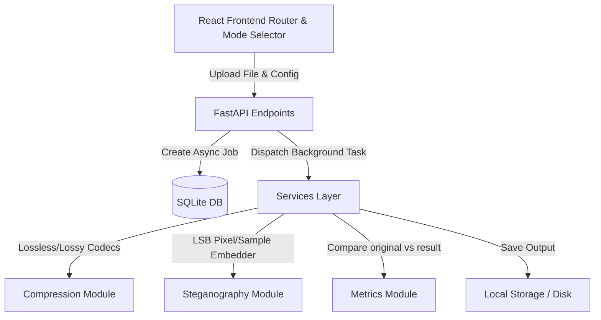

# MyCompress — Media Compressor & Steganography Engine

🇮🇩 [Baca dalam Bahasa Indonesia](./README.id.md)

[](https://www.python.org/)
[](https://fastapi.tiangolo.com/)
[](https://react.dev/)
[](https://vitejs.dev/)

MyCompress is a high-performance web application designed to compress multimedia files (Images, Audio, and Video) and hide encrypted messages using Least Significant Bit (LSB) steganography. It offers an intuitive interface to handle security, compression, and analysis in one platform.

This engine resolves a fundamental conflict: applying lossy compression to steganographic media typically destroys the embedded message. By decoupling compression and steganography into fully independent operations (Compress-Only vs Stego-Only), MyCompress ensures complete payload integrity while offering state-of-the-art compression tools.

---

## 🚀 Key Features

*   **Multimedia Compression**: Support for RLE and Huffman coding (images), FFmpeg bitrate downscaling (audio WAV to MP3), and H.264 CRF encoding (video).
*   **Independent Steganography**: Embed and extract text messages inside cover media (pixel RGB for images, PCM samples for WAV audio, and spatial RGB channels of I-frames for MP4 video) without hidden cross-dependencies.
*   **Optional Stego Text Compression**: Option to compress the hidden message text (via RLE or Huffman) before embedding, maximizing capacity.
*   **AES-256 Encryption**: Password-protect embedded messages using AES-GCM encryption.
*   **Fidelity & Performance Metrics**: Real-time evaluation of PSNR, SSIM, MSE, size comparison (original vs result with ratio delta), and processing speed.
*   **Job History & Tracking**: Access previous jobs with detailed operations (`compress`, `decompress`, `embed`, `extract`) and metrics.

---

## 📸 Demo & User Interface

<!-- TODO: Capture UI screenshot showing the newly implemented Mode Selector tabs (Compress vs Stego) and the collapsible technical details panel. Place it in /docs/assets/ui_screenshot.png -->


---

## 🛠️ Tech Stack

| Component | Technology | Use Case |
|---|---|---|
| **Frontend** | React, TypeScript, Vite, Vanilla CSS | Interactive SPA, responsive layout, real-time polling |
| **Backend API**| FastAPI, Python 3.11, Uvicorn | Async endpoint orchestration, background processing |
| **Codecs & Core**| Pillow, NumPy, FFmpeg, OpenCV | Image array manipulation, WAV/MP3 transcoding, I-frame extraction |
| **Security** | PyCryptodome (AES-256 GCM) | Password hashing, message encryption & decryption |
| **Database** | SQLite, SQLAlchemy | Persistence of jobs, logs, and quality metrics |

---

## 📐 Architecture



---

## 🏁 Quick Start

Make sure you have **Python 3.11+** and **Node.js 18+** installed.

1. **Clone the Repository**:
   ```bash
   git clone https://github.com/your-username/mycompress-media_compressor.git
   cd mycompress-media_compressor
   ```

2. **Start Backend Server**:
   ```bash
   cd backend
   python -m venv .venv
   source .venv/bin/activate  # On Windows: .venv\Scripts\activate
   pip install -r requirements.txt
   uvicorn app.main:app --reload
   ```
   *For detailed configuration, see [backend/README.md](./backend/README.md).*

3. **Start Frontend Client**:
   ```bash
   cd ../frontend
   npm install
   npm run dev
   ```
   *For detailed UI customisation, see [frontend/README.md](./frontend/README.md).*

---

## ⚠️ Known Limitations

1. **JPG Compression Boundary**: LSB embedding directly in JPG files is not supported since lossy JPEG compression destroys LSB bits. The engine automatically decodes JPG cover images into raw pixel buffers and exports stego files in **lossless PNG** format.
2. **Stego Video Size Overhead**: To preserve LSB bits in I-frames, the resulting MP4 video is remuxed using lossless H.264 (`libx264rgb` with `-crf 0`). This causes a ~21.5x increase in output file size compared to the original MP4.
3. **NFR 30s Processing Limit**: Processing large videos (with high I-frame counts) may exceed the 30-second target. The backend processes these asynchronously via FastAPI `BackgroundTasks`, so they do not block the thread.

*Read the [docs/technical_report.md](./docs/technical_report.md) for full academic details and evaluations.*

---

## 👥 Team & Contribution

*   **Scrum Team & Roles**: Developed by Project Group 1 (Software Engineering / Pemrograman Perangkat Lunak).
*   **Course Context**: PPL Course Assignment, Computer Science Department, UIN Sunan Gunung Djati Bandung.
*   **Collaborators**:
    *   *Student Name 1* (Product Owner / Lead Architect)
    *   *Student Name 2* (Scrum Master / Backend Developer)
    *   *Student Name 3* (Frontend Developer)

---

## 📜 License

*The license of this academic project is subject to confirmation by the project mentors. Please contact the team before copying or redistributing.*
