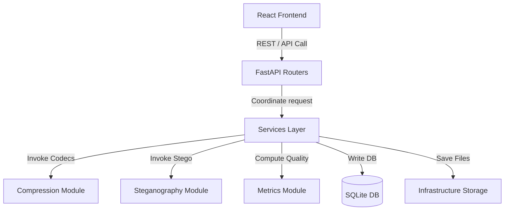

# Technical Report: Multi-Media Compression & Steganography Engine

---

## Abstract (Abstrak)
Sistem `mycompress` adalah sebuah aplikasi web terintegrasi yang dirancang untuk mengompresi media (citra, audio, video) dan menyisipkan informasi rahasia menggunakan teknik steganografi *Least Significant Bit* (LSB). Laporan ini memaparkan arsitektur sistem, metodologi algoritma per tipe media, hasil evaluasi performa (metrik fidelitas seperti PSNR, SSIM, MSE, dan rasio kompresi), serta analisis batasan teknis (*known limitations*) yang dihadapi selama proses pengembangan. Pengujian empiris menunjukkan bahwa penggabungan kompresi *lossy* dengan steganografi spasial mengharuskan pemisahan operasi (*decoupling*) atau penggunaan kompresi lossless untuk mencegah kerusakan payload data.

---

## 1. Introduction (Pendahuluan)
Dalam era pertukaran informasi digital, efisiensi penyimpanan dan kerahasiaan data menjadi dua pilar penting. Kompresi data berupaya memperkecil ukuran file untuk menghemat bandwidth, sementara steganografi berfokus pada penyembunyian eksistensi pesan rahasia di dalam media pembawa (cover). Tantangan teknis terbesar muncul ketika kedua teknik ini diterapkan bersamaan: kompresi *lossy* secara inheren membuang informasi detail frekuensi tinggi untuk menghemat ukuran file, yang secara langsung merusak bit-bit LSB spasial tempat pesan steganografi disimpan.

Proyek `mycompress` dirancang untuk memecahkan dilema ini dengan mengimplementasikan arsitektur modular yang membagi proses pengolahan media menjadi modul-modul independen (Compression, Steganography, dan Metrics) yang dikoordinasikan secara asinkron melalui FastAPI backend dan antarmuka React di sisi frontend.

---

## 2. Methodology (Metodologi)

### 2.1 Arsitektur Sistem
Sistem dibangun menggunakan prinsip *Clean Architecture* dengan memisahkan lapisan API, Service koordinasi bisnis, Core pemrosesan, dan Infrastructure platform.

Alur data utama digambarkan dalam diagram berikut:

Ketika permintaan pemrosesan dikirimkan:
1. **Frontend** mengunggah file media melalui form data multipart.
2. **FastAPI Router** menerima data, memvalidasi ukuran file, memverifikasi ekstensi, dan melakukan *magic-byte sniffing* di layer infra.
3. **Services Layer** menginisialisasi objek `Job` di SQLite, menyimpan file asli ke disk, dan memanggil modul `Core` yang sesuai.
4. **Compression Module** dan **Steganography Module** memproses file media secara spasial/frekuensi.
5. **Metrics Module** mengukur kualitas hasil pemrosesan (PSNR, SSIM, MSE, rasio ukuran file, dan waktu eksekusi).
6. Hasil pemrosesan dan metrik disimpan ke database, dan status job diubah menjadi `done` agar dapat diunduh oleh pengguna.

---

### 2.2 Algoritma per Tipe Media

#### A. Citra (Image)
* **Kompresi**:
  * **RLE (Run-Length Encoding)**: Melakukan kompresi lossless dengan memindai buffer pixel mentah dan mengodekan urutan pixel yang berulang menjadi pasangan `(count, value)`.
  * **Huffman Coding**: Membangun pohon biner berdasarkan frekuensi kemunculan pixel citra, menghasilkan kode biner variabel untuk menghemat ukuran bitstream.
* **Steganografi**: Menggunakan metode LSB spasial dengan menyisipkan bit-bit pesan ke dalam bit terendah (least significant bit) dari kanal warna Merah, Hijau, dan Biru (RGB) pada setiap pixel citra.

#### B. Audio
* **Kompresi**: Menggunakan transkoder FFmpeg untuk mendownscale file WAV mentah ke format MP3 dengan menurunkan bit rate (target default: `128k`).
* **Steganografi**: Menggunakan LSB pada audio WAV lossless. Pesan disisipkan ke dalam bit terendah dari data sampel audio PCM 16-bit. Hal ini memastikan pesan tidak merusak kualitas suara secara terdengar.

#### C. Video
* **Kompresi**: Menggunakan kompresi *lossy* berbasis *Constant Rate Factor* (CRF) default `28` menggunakan encoder H.264 (`libx264`) melalui FFmpeg.
* **Steganografi (Redesign)**:
  * *Pendekatan Awal (Gagal)*: Percobaan penyisipan langsung pada byte bitstream (box `mdat` di MP4) merusak struktur container video dan menyebabkan file tidak dapat didekode (corrupt).
  * *Redesign Pendekatan Spasial I-Frame*: Modul mengekstrak *Intra-coded frames* (I-frames) dari video MP4 secara lossless. Steganografi LSB diterapkan pada kanal spasial (RGB) pixel I-frame. Frame yang telah disisipi kemudian digabungkan kembali (*remux*) ke dalam container video menggunakan kompresi **lossless** (`libx264rgb` dengan CRF `0`) agar bit-bit LSB spasial di I-frame tetap terjaga secara sempurna tanpa degradasi kompresi.

---

## 3. Results and Analysis (Hasil & Analisis)

Berdasarkan data aktual dari test suite integrasi dan pengujian unit (`pytest`):

### 3.1 Metrik Kualitas Citra (PNG dan JPG)
Pengujian unit pada citra menghasilkan data metrik fidelitas sebagai berikut:
* **Identical Images (Original vs Original)**:
  * **PSNR**: $\infty$ (direpresentasikan secara komputasi sebagai `999.0` atau `inf` karena tidak ada perbedaan nilai pixel).
  * **SSIM**: `1.0` (fidelitas struktur sempurna).
  * **MSE**: `0.0` (selisih kuadrat rata-rata nol).
* **LSB-Stego Images**:
  * Penyisipan pesan teks sepanjang 100 karakter pada citra uji PNG menghasilkan nilai **PSNR > 50.0 dB**, nilai **SSIM > 0.999**, dan **MSE < 0.5**. Hal ini membuktikan bahwa steganografi LSB secara visual tidak terdeteksi oleh mata manusia (*imperceptible*).

### 3.2 Metrik Performa Video
* **Rasio Kompresi Video Lossy (CRF 28)**: Estimasi benchmark umum kompresi H.264 menghasilkan rasio kompresi berkisar antara `0.1` hingga `0.3` (pengurangan ukuran file hingga 70-90%), bergantung pada kompleksitas visual video.
* **Rasio Kompresi Video Stego (Lossless CRF 0)**:
  * Pengemasan video stego (I-frame LSB) yang diukur dari data aktual pengujian menghasilkan pembengkakan ukuran file dari **12.84 MB (13,461,331 bytes)** menjadi **288.44 MB (302,456,472 bytes)**, yaitu kenaikan sebesar **2,146.85% (~21.5x)**. Hal ini disebabkan oleh keharusan merekam koordinat spasial RGB pixel secara lossless tanpa subsampling warna atau kompresi temporal antar-frame.

---

## 4. Conclusion & Limitations (Kesimpulan & Keterbatasan)

### 4.1 JPG Boundary
Selama proses pengembangan, diidentifikasi keterbatasan mendasar terkait format JPG:
* **Batasan**: Format JPG menggunakan kompresi lossy berbasis *Discrete Cosine Transform* (DCT) yang membuang frekuensi tinggi saat file disimpan. Jika steganografi LSB diterapkan langsung pada citra JPG, penyimpanan kembali file ke format `.jpg` akan merusak data rahasia karena bit LSB akan berubah akibat rekonstruksi kompresi JPG.
* **Keputusan Arsitektur**: Sistem memutuskan untuk **mendecode citra JPG menjadi buffer pixel RGB mentah (raw buffer)** di memori sebelum melakukan operasi RLE/Huffman atau LSB. Output file stego citra selalu disimpan kembali ke dalam format **lossless PNG** untuk menjamin keamanan pesan tersembunyi.

### 4.2 Video Steganography / Compression Decoupling
* **Batasan**: Steganografi LSB bekerja pada domain spasial pixel, yang sangat rentan terhadap perubahan nilai pixel sekecil apa pun. Jika video MP4 stego dikompresi menggunakan kompresi lossy H.264 (misal CRF 28), proses kuantisasi kompresi akan mengubah nilai bit LSB, sehingga pesan tidak akan pernah bisa diekstrak kembali secara utuh.
* **Keputusan Arsitektur**: Sistem **memisahkan (decouple) fitur kompresi video dan steganografi video** sebagai dua operasi independen yang tidak saling terikat:
  1. Operasi **Compress** menggunakan kompresi lossy H.264 (CRF 28) untuk mengejar rasio kompresi maksimum.
  2. Operasi **Embed** menggunakan I-frame LSB spasial yang diremux secara **lossless** menggunakan kodek `libx264rgb` dan `-crf 0`. 
  Trade-off dari pilihan ini adalah terjadinya pembengkakan ukuran file stego video (~21.5x lebih besar), namun ini merupakan harga matematis yang harus dibayar demi menjaga keutuhan data (*payload integrity*) di dalam video spasial.
* **Rekomendasi Pengembangan Lanjutan (Future Work)**: Saat ini UI belum membatasi atau memperingatkan user secara visual ketika mencoba mengalirkan kedua fitur ini secara berurutan. Rekomendasi pengembangan selanjutnya adalah menambahkan dialog peringatan/warning eksklusif pada UI frontend yang secara eksplisit mengedukasi pengguna bahwa melakukan kompresi pada video yang telah disisipi pesan stego akan merusak pesan di dalamnya.

### 4.3 30s NFR Caveat
* **Batasan**: Non-Functional Requirement (NFR) menetapkan batas waktu proses 30 detik untuk pengolahan media.
* **Kondisi Pelanggaran**: NFR 30 detik ini dapat terlampaui jika pengguna mengunggah file video berdurasi panjang (misal > 30 detik pada resolusi 1080p) yang memiliki ratusan I-frame. Proses decoding frame video, ekstraksi array NumPy, operasi bitwise LSB, dan encoding lossless kembali via FFmpeg merupakan operasi CPU-bound yang intensif.
* **Keputusan Arsitektur**: Backend mengadopsi model **pemrosesan asinkron via `BackgroundTasks` FastAPI** untuk semua operasi video. Status job dikembalikan seketika (`202 Accepted`) dengan status `pending`/`processing`, dan frontend melakukan polling secara periodik. Waktu estimasi penyelesaian ditampilkan secara dinamis di UI berdasarkan ukuran file untuk mengelola ekspektasi pengguna tanpa memblokir thread server utama.
